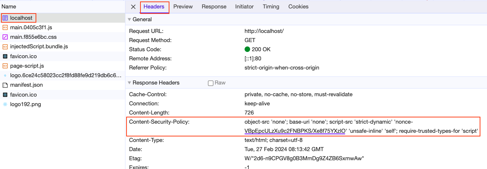
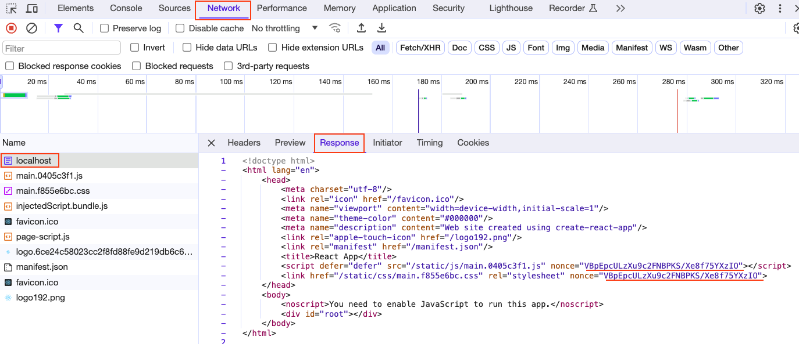

# React Web App with CSP nonce

A basic React application + webpack + nginx/node server with CSP nonce regenerated for every page request.

The `nonce` attribute in the script and styles lets you “whitelist” inline script and style elements, eliminating the need for the broader and less secure CSP unsafe-inline directive, thereby maintaining the fundamental CSP feature of prohibiting inline script and style elements in general.

Utilising the `nonce` attribute in script or style informs browsers that the inline content was deliberately included in the document by the server (nginx/node) rather than being injected by a potentially malicious third party.

The [Content Security Policy](https://web.dev/articles/csp) article’s [If you absolutely must use it](https://web.dev/articles/csp#if-you-absolutely-must-use-it) section has a good example of how to use the nonce attribute in the script or style:

The main idea of the `nonce` is that: nonces must be random and regenerated for every page request and they must be unguessable.

Here the react application build using webpack, in the webpack config the `NonceInjector Plugin` is used to put a placeholder (`_NONCE_`) for the attribute `nonce` in script and style HTML tags.

e.g.

```html
<script
  defer="defer"
  src="/static/js/main.0405c3f1.js"
  nonce="_NONCE_"
></script>
<link href="/static/css/main.f855e6bc.css" rel="stylesheet" nonce="_NONCE_" />
```

```javascript
const HtmlWebpackPlugin = require("html-webpack-plugin");

class NonceInjector {
  constructor(NONCE_PLACEHOLDER) {
    this.NONCE_PLACEHOLDER = NONCE_PLACEHOLDER;
  }
  apply(compiler) {
    compiler.hooks.thisCompilation.tap("NonceInjector", (compilation) => {
      HtmlWebpackPlugin.getHooks(compilation).afterTemplateExecution.tapAsync(
        "NonceInjector",
        (compilation, callback) => {
          const { headTags } = compilation;
          headTags.forEach((tag) => {
            tag.attributes.nonce = this.NONCE_PLACEHOLDER;
          });
          callback(null, compilation);
        }
      );
    });
  }
}

module.exports = NonceInjector;
```

Then in the Server before serving the index.html find the `_NONCE_` and replace with the random base64 string created. It will be replaced on each page load to make it unguessable.

```html
<script
  defer="defer"
  src="/static/js/main.0405c3f1.js"
  nonce="VBpEpcULzXu9c2FNBPKS/Xe8f75YXzIO"
></script>
<link
  href="/static/css/main.f855e6bc.css"
  rel="stylesheet"
  nonce="VBpEpcULzXu9c2FNBPKS/Xe8f75YXzIO"
/>
```

Then in the header we enforce the HTML file to only accept the script and styles with nonce by putting the CSP policy in the Header

```
header(
      "Content-Security-Policy",
      `object-src 'none'; base-uri 'none'; script-src 'strict-dynamic' 'nonce-${nonce}' 'unsafe-inline' 'self'; require-trusted-types-for 'script'`
    );
```

In Nginx we utilise the [njs](https://github.com/velusgautam/react-app-with-csp-nonce/blob/main/nginx-server/nginx/njs/main.mjs) scripting to generate the random nonce string.
[Nginx Config file](https://github.com/velusgautam/react-app-with-csp-nonce/blob/main/nginx-server/nginx/nginx.conf)

In Node we use the same logic in the [server](https://github.com/velusgautam/react-app-with-csp-nonce/blob/main/node-express-server/server.js) file

## Example Projects

- [Nginx Server Example](https://github.com/velusgautam/react-app-with-csp-nonce/tree/main/nginx-server)

- [Node Server Example](https://github.com/velusgautam/react-app-with-csp-nonce/tree/main/node-express-server)

### Verify CSP Header



### Verify Nonce in script and style


