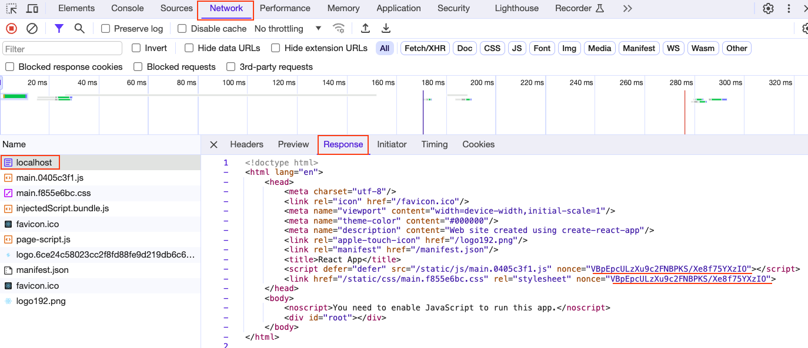

# React + Node Express Server

### To verify CSP working you need to run it a server - client setup

## Example with Docker

The below command will start running the application in port 8080. You can run below command and then go to browser `http://localhost:8080/` to see the application running

```shell
docker build -t react-node-app . && docker run -it --rm -e PORT=8080 -p 8080:8080 react-node-app
```

Inspect and see in the Network tab the nonce is being changed in each request.

### Verify CSP Header


### Verify Nonce in script and style



<span style="font-size:10px;">

```
PORT here is port where node starts inside docker. -p 8080:{3000} should be changed accordingly if you change PORT=3000
```

</span>

## Application Setup in Local

Run below commands to setup the application

```shell
npm install
```

```shell
npm run build
```

```shell
npm run server
```

## Local Development

```shell
npm install
```

```shell
npm run start
```

### Node Server

Server config in the [server.js](https://github.com/velusgautam/react-app-with-csp-nonce/blob/main/node-express-server/server.js) file
